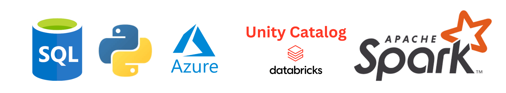

# Azure Databricks ETL Pipeline Project

## Overview
End-to-end ETL data engineering project simulating a production-grade platform.
Raw data from Azure Data Lake Storage Gen2 is processed with Azure Databricks (PySpark and SQL), governed using Unity Catalog, and orchestrated via Lakeflow Declarative Pipelines.

The pipeline follows the Medallion Architecture (Bronze, Silver, Gold) to produce scalable, analytics-ready data.
It uses the Brazilian Olist E-Commerce Public Dataset and covers orders, payments, deliveries, products, sellers, and reviews, demonstrating how raw data is transformed into reliable business-ready insights.

---

## Architecture

### Cloud Platform
- **Azure subscription**
  - Azure Databricks premium account (Unity Catalog enabled)
  - ADLS gen2 storage account (source, bronze, silver, gold containers)
  - Access connector for Azure Databricks

### Tech Stack
- **Frameworks:** Delta lake, Apache spark, Lakeflow Declarative Pipelines 
- **Languages:** Python, SQL, PySpark  
- **Data Governance:** Unity Catalog  
- **Orchestration:** Databricks Lakeflow (Declarative Pipelines)                      
- **Data Architecture:** Medallion (Bronze → Silver → Gold)

---

## Pipeline Flow

### 1.🥉 Bronze Layer – Raw Ingestion
- Ingests raw CSV files from ADLS Gen2 source container.
- Converts CSV to delta lake streaming tables with schema inference.
- Stores the managed tables into **bronze** schema as single source of truth.

### 2.🥈 Silver Layer – Cleansed & Conformed
- Transformation applied :
    - Data cleaning and handling missing values.
    - Data standardization and abbreviation handling.
    - Expectations and quality checks.
- Pyspark and dlt are used in this layer.
- Data stored in **silver** schema as managed streaming tables.

### 3.🥇 Gold Layer – Star Schema + KPIs
- Data modeled into **Star Schema** (fact and dimension tables).
- Built using SQL pipelines referencing silver tables.
- Implements:
  - Joins, Business metrics and KPIs.
  - Data quality expectations.
  - Optimized **Materialized Views** for performance and fast queries.

---

## Business Value Added

The Gold layer delivers actionable insights for decision-making:

### Key Metrics
- Total sales revenue  
- Order conversion rate  
- Delivery SLA performance  
- Product category profitability  
- Seller performance KPIs  
- Customer repeat behavior  
- Review sentiment progress  

### Use Cases Enabled
- Marketing segmentation  
- Forecasting (inventory, sales)  
- Customer experience analysis
- Machine learning

This transforms raw e-commerce data into measurable value that supports strategic and operational decisions.

---

## Repository Structure

